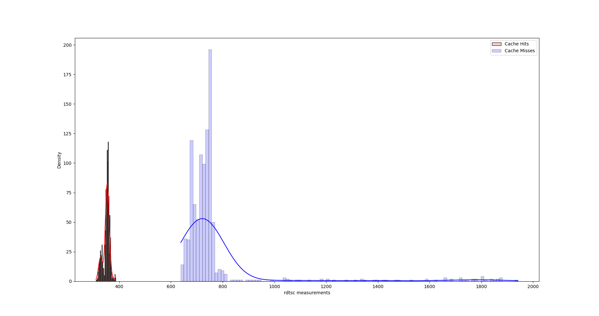

# Computing hit/miss threshold

Before mounting any cache side-channel attack, it is important to meaasure
a threshold between cache misses and cache hits which the attack uses to
differentiate.

Strategy:

1. Collect cache hits

2. Collect cache misses

3. Plot a frequency distribution of the same

4. Manually choose the threshold

## Build and run

1. Run `bash threshold.sh` to perform the experiment

## Sample Run

The following run has been performed on `12th Gen Intel(R) Core(TM) i5-12500 (microcode: 0x35)`

